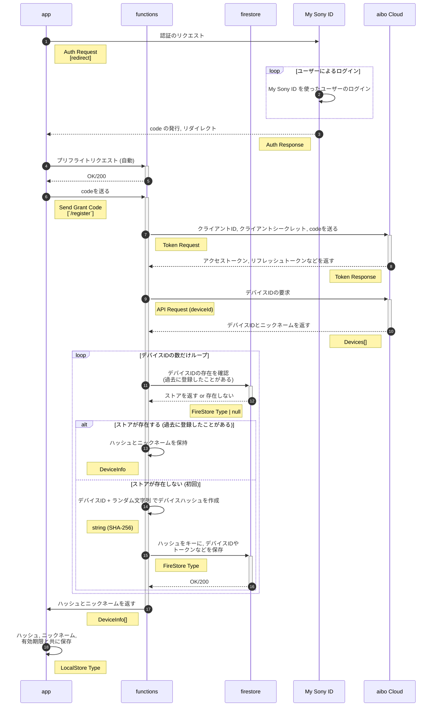
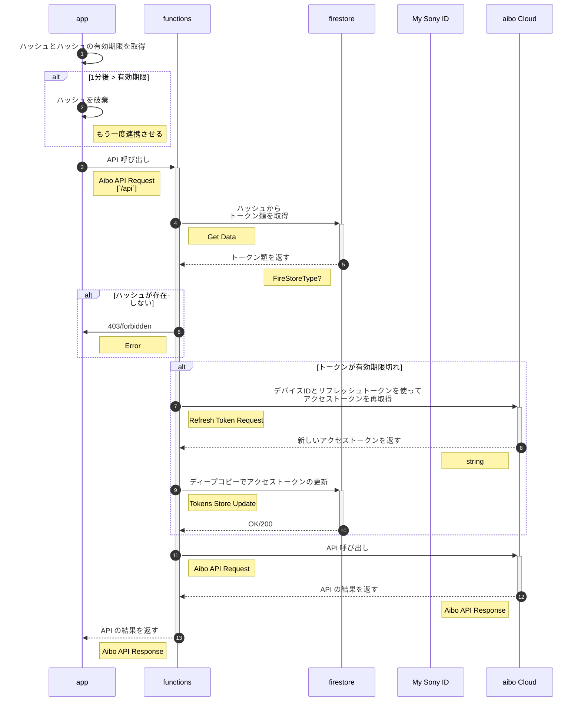
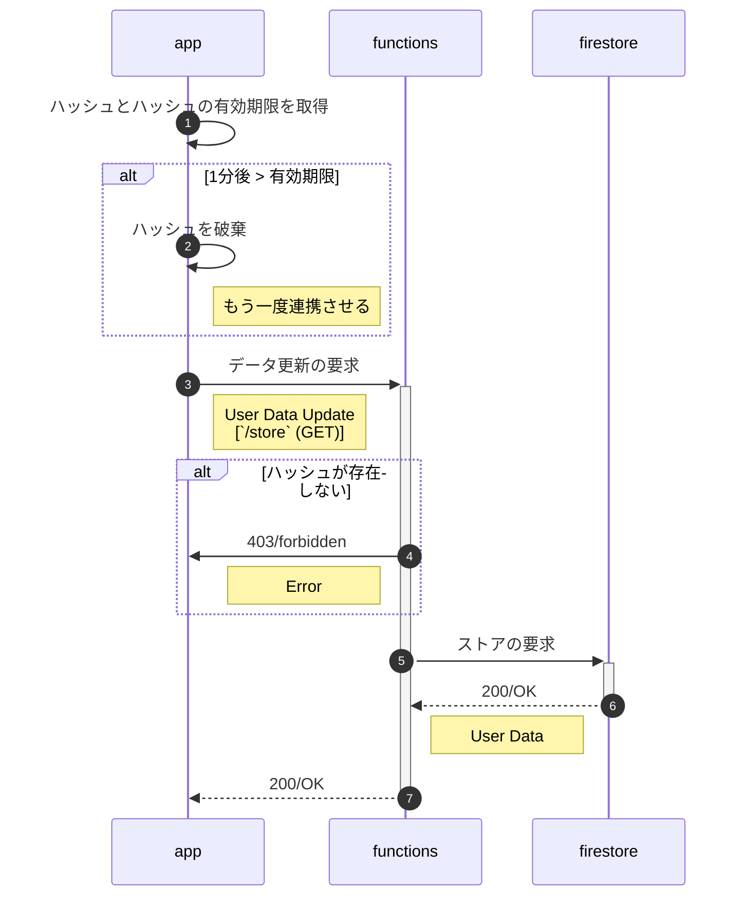
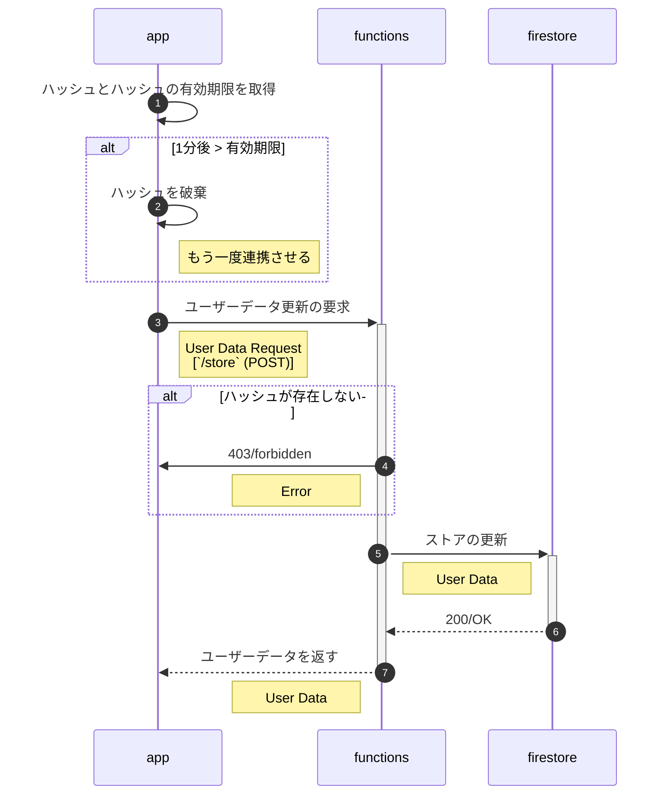

# aibo でクイズ

aibo に関するクイズと併せて aibo の API を叩いてみよう！

## 目標

- aibo に関するクイズを出題し, ユーザーのアクションに応じて aibo が振る舞いをするようフロントエンドを実装してみよう.
- My Sony ID と aibo を連携できるよう OAuth を学んで, 簡単な認証フローを実装してみよう.
- API の定義とプロジェクトの雛形, 設計がされているので, チームで 協力, 分担 して実際に実装してみよう.

## リポジトリの構成

| パス    | 役割                   |
| ------- | ---------------------- |
| `/app`  | フロントエンドのソース |
| `/docs` | ドキュメント類         |
| `/func` | バックエンドのソース   |

## シーケンス図

### 連携時

### API 呼び出し時

### スコア (ユーザーデータ) 取得

### スコア (ユーザーデータ) 登録

